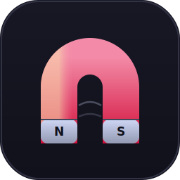

<p align="center">
  
</p>

<h1 align="center">🧲 Ferrite</h1>

<p align="center">
  <strong>A magnetically attractive, low-CPU, configurable status bar for <a href="https://swaywm.org/">sway</a> — written in Rust.</strong>
  <br/>
  <sub>The name: <em>ferrite</em> is a magnetically attracted material — and this bar is <em>magnetically attractive</em>.</sub>
</p>

<p align="center">
  <a href="https://www.rust-lang.org/"></a>
  
  
  
  <a href="https://swaywm.org/"></a>
  <a href="#license"></a>
</p>

<p align="center">
  
  
  
  
  
  
</p>

---

Ferrite is a reimagining of a typical `swaybar` bash script — **the same information on the bar**, but with the fork/exec storm and the `sleep 1`-inside-`awk` stalls removed. The binary is meant to be placed in your sway config **without a `timeout` wrapper** and still idle the CPU between ticks.

## ✨ Features

|                                  |                                                                                                                                                                                |
| -------------------------------- | ------------------------------------------------------------------------------------------------------------------------------------------------------------------------------ |
| 🪶 **Near-zero CPU**             | ~0.35 s of core-time over a 30 s window — **1.2 %** of one core, almost entirely two throttled fork-helpers (`pamixer`, `iw`); the 13 sysfs/D-Bus/IPC modules sum to ≈ 0.04 s. |
| 🧠 **Event-driven, not polled**  | Bluetooth via `org.bluez` D-Bus; now-playing via MPRIS2 D-Bus. **0 CPU between changes.** (`lang` is the one exception — see below.)                                           |
| 🎨 **i3bar protocol done right** | Colors, click events, and Pango markup — the bash bar had none.                                                                                                                |
| 🌈 **Pywal colors**              | `[colors]` palette with a `source = "pywal"` mode that fills unset slots from `~/.cache/wal/colors.json`; explicit TOML always wins.                                           |
| 🧩 **Fully customizable layout** | One template string: `{module}` placeholders + arbitrary literal separators — as many different separators per line as you want.                                               |
| 🔣 **Pluggable icon packs**      | Built-in `nerd` / `emoji` / `unicode` / `none`, plus custom TOML packs and per-key overrides.                                                                                  |
| 🖱️ **Clickable, config-driven**  | Every module is clickable by its layout name; `[click_actions.<name>]` maps button numbers → shell commands (pipes/`$vars` ok).                                                |
| 🦀 **Rust-tight**                | `clippy::pedantic` + `nursery` with `-D warnings`; no `unwrap` on I/O paths; graceful on partial hardware.                                                                     |
| 📦 **Tiny**                      | Stripped release binary ≈ **1.8 MiB**; resident memory ≈ **4 MiB**.                                                                                                            |

## 📊 The bar

A live `--plain` sample (Nerd Font glyphs render as icons in a real terminal):

```text
RU |  󰈛 3%  󰏅 6.4G  󰸹 50°C  󰂢 79% 2h15 |  󰤨 TP-Link_E5DA  98%  192.168.0.108  󰌄 On  󰲓 On  󰕃 0%  󰃠 100% |  󰏔 12  󰝚 Daft Punk - Aerodynamic  11:51 | 26 июня
```

Grouped by the layout template — `lang | cpu mem temp bat | net vpn bt vol bri | packages mpris date` — with `|` between groups and a space within. Blocks whose backing tool is absent (no VPN, no player, no pending updates) hide themselves.

## ⚡ Why it uses ~0 CPU

- **One writer thread** renders a snapshot of shared state to stdout every `render_interval_ms` (default 250 ms) and sleeps the rest of the tick.
- **Event-driven modules** block until the thing they watch actually changes:
  - `bt` (Bluetooth) subscribes to `org.bluez` `PropertiesChanged` on the system D-Bus — 0 forks, 0 CPU between connect/disconnect events.
  - `mpris` (now-playing) subscribes to MPRIS2 `PropertiesChanged` + `NameOwnerChanged` on the session D-Bus — 0 forks, 0 CPU between track/playback changes.
- **Zero-fork sysfs/proc readers** for `cpu`, `mem`, `temp`, `bat` (incl. time-remaining), `bri`, `disk`, `load`, `vpn`, and the network rx/tx rate — a handful of micro-reads per tick, no subprocesses.
- **Multi-interface `net`** — enumerates every connected physical NIC (PCI/USB), not just the default-route one, so Wi-Fi and LAN show at once. `modules.net.interfaces` selects which kinds appear: `["wifi"]`, `["lan"]`, or `["wifi","lan"]` (default). Virtual links (`lo`, bridges, `veth`, `docker*`, tun/tap VPNs) are filtered out via `/sys/class/net/<dev>/device`; a NIC shows only when `operstate=up` or `carrier=1`.
- The only forks are throttled, timeout-guarded helpers (`iw`, `ip`, `pamixer`, `checkupdates`) fired at most once per multi-second interval (packages defaults to 30 min), each killed hard if it hangs.
- When sway hides the bar it sends `SIGSTOP`; the kernel freezes the process and CPU goes literally to zero. No external `timeout` is needed — the stream is continuous, sway never waits for a one-shot reply.

### 📐 Measured footprint

Direct `ferrite --plain --config <cfg>` starts (no sway, no swaybar) measured over a 30 s wall-clock window each. **core-time counts self _and_ forked helpers** (`utime+stime+cutime+cstime`) — `pamixer`/`iw`/`ip` are real work the bar triggers, so their CPU is included. core-time / RAM are hardware-independent; "% of machine" scales with your core count.

Configs measured:

- **`user-live`** — `~/.config/ferrite/config.toml` (the real bar the author runs: `lang cpu mem temp bat net bt vol bri date`).
- **`full-default`** — `assets/default-config.toml` (every module enabled at once: all 15).
- **`solo-<m>`** (×15) — the default config with `layout` reduced to a single module, to isolate each module's cost.
- **`pair-<a>-<b>`** (×105) — every two-module combination, to test that per-module costs are additive.

Test environment:

```text
OS          : Arch Linux, kernel 7.0.13-zen1-1-zen (x86_64)
Compositor  : sway 1.12 (Wayland)
CPU         : AMD Ryzen 5 PRO 4650U  — 6 cores / 12 threads, base 2.1 GHz
RAM         : 16 GiB
```

Headline (30 s each):

```text
user-live     : 0.350 s core-time  →  1.17 % of one core  /  0.10 % of machine (of 12)
full-default  : 0.360 s core-time  →  1.20 % of one core  /  0.10 % of machine (of 12)
VmRSS         : 4 264 kB (user-live) / 4 636 kB (full-default), stable over 30 s
Pss           : 1 539 kB (user-live) / 2 715 kB (full-default)   (shared pages divided out)
Threads       : 13 (user-live) / 20 (full-default)
Binary        : 1 797 320 bytes (≈ 1.71 MiB), ELF x86-64 PIE, stripped
```

Per-module solo cost (30 s, sorted by core-time; `0.000` = below the 10 ms `/proc` tick resolution — a 60 s re-run of the 13 non-forking modules together measured 0.080 s, i.e. ≈ 0.04 s / 30 s, and `lang` alone 0.010 s / 60 s):

| Module     | core-time / 30 s | % of one core | VmRSS kB | threads | Cost driver                                     |
| ---------- | ---------------: | ------------: | -------: | ------: | ----------------------------------------------- |
| `vol`      |          0.250 s |        0.83 % |    3 568 |       2 | forks `pamixer` every `interval_ms`             |
| `net`      |          0.110 s |        0.37 % |    3 672 |       2 | forks `iw`/`ip` every `interval_ms`             |
| `cpu`      |          0.010 s |        0.03 % |    3 596 |       2 | `/proc/stat` Δ, no fork                         |
| `bat`      |          0.010 s |        0.03 % |    3 544 |       2 | sysfs, no fork                                  |
| `lang`     |          0.000 s |        0.00 % |    3 428 |       2 | sway IPC `get_inputs` poll, no fork             |
| `mpris`    |          0.000 s |        0.00 % |    4 096 |       7 | MPRIS2 D-Bus (session), no fork                 |
| `bt`       |          0.000 s |        0.00 % |    3 860 |       4 | bluez D-Bus (system), no fork                   |
| `bri`      |          0.000 s |        0.00 % |    3 480 |       2 | sysfs, no fork                                  |
| `mem`      |          0.000 s |        0.00 % |    3 572 |       2 | `/proc/meminfo`, no fork                        |
| `temp`     |          0.000 s |        0.00 % |    3 456 |       2 | sysfs, no fork                                  |
| `disk`     |          0.000 s |        0.00 % |    3 584 |       2 | `statvfs`, no fork                              |
| `load`     |          0.000 s |        0.00 % |    3 556 |       2 | `/proc/loadavg`, no fork                        |
| `date`     |          0.000 s |        0.00 % |    3 564 |       2 | `time` crate, no fork                           |
| `packages` |          0.000 s |        0.00 % |    3 344 |       2 | forks `checkupdates` every 30 min (0 in window) |
| `vpn`      |          0.000 s |        0.00 % |    3 472 |       2 | sysfs operstate, no fork                        |

**Where the CPU actually goes:** `vol` (0.250 s) + `net` (0.110 s) = **0.360 s**, which is the entire `full-default` figure. The other 13 modules — including the `lang` IPC poller — sum to ≈ 0.04 s / 30 s, i.e. noise. So the bar's CPU is almost entirely the two throttled fork-helpers, **and both are tunable**: raise `[modules.volume].interval_ms` and `[modules.net].interval_ms` to fork less often and the core-time drops proportionally. `lang`'s once-per-second `get_inputs` round-trip costs ≈ 0.17 ms / s — negligible.

**Additivity (the 105 pair runs):** `|measured − (soloA + soloB)|` averaged 0.007 s, max 0.050 s (one fork-timing jitter spike). Modules run on independent threads and CPU core-time is additive across threads, so any combination's CPU ≈ the sum of its solo rows — you can read any subset's cost off the table above. RAM is _not_ additive (shared pages, one binary): the full 15-module bar is 4.6 MiB, not 53 MiB.

Reproduce (core-time = self + reaped children; field 14–17 of `/proc/<pid>/stat`):

```sh
PID=$(pgrep -f '/home/.*ferrite' | head -1)
a=$(awk '{print $14+$15+$16+$17}' /proc/$PID/stat); sleep 30; b=$(awk '{print $14+$15+$16+$17}' /proc/$PID/stat)
echo "core-time: $(awk -v d=$((b-a)) -v c=$(getconf CLK_TCK) 'BEGIN{printf "%.3f", d/c}') s"
grep -E '^(VmRSS|VmHWM|VmPeak):' /proc/$PID/status
```

## 🚀 Install

```sh
cargo install --path .          # from a clone
# or copy the release binary directly:
cp target/release/ferrite ~/.cargo/bin/
```

## 🧷 Wire it into sway

In `~/.config/sway/config`:

```text
bar {
    status_command = "ferrite"     # no `timeout` — see "Why ~0 CPU" above
    # ...your colors, position, fonts, etc.
}
```

Then `swaymsg reload`. Ferrite writes `~/.config/ferrite/config.toml` on first run (if absent) and continues with the defaults.

## 🛠️ Usage

```text
ferrite [--plain] [--config <path>] [--print-config]
```

| Flag              | Effect                                                                                                                                     |
| ----------------- | ------------------------------------------------------------------------------------------------------------------------------------------ |
| `--plain`         | Text output (like the old bash bar), no JSON/colors. Handy for debugging in a terminal.                                                    |
| `--config <path>` | Load config from `<path>` instead of `~/.config/ferrite/config.toml`.                                                                      |
| `--print-config`  | Dump the built-in default config to stdout and exit (`ferrite --print-config > ~/.config/ferrite/config.toml` to seed a hand-edited file). |

## ⚙️ Configuration

Config lives at `~/.config/ferrite/config.toml`. Run `ferrite --print-config` to see every option with comments — it dumps exactly the file below, which is the complete, valid default.

<details>
<summary><strong>📖 Full default config</strong> (<code>--print-config</code> output)</summary>

```toml
# Ferrite — default configuration.
# Place at ~/.config/ferrite/config.toml (auto-generated on first run if absent).
# Icon packs live in ~/.config/ferrite/packs/<name>.toml and are selected via
# [icons].pack. Run `ferrite --print-config` to dump this file to stdout.

[bar]
render_interval_ms = 250   # how often the bar re-renders (ms). 250 = smooth clock.
protocol = "i3bar"          # "i3bar" (colors/clicks/pango) | "plain" (text like the old bash)
markup = "pango"            # "none" | "pango"  (sway supports pango markup)
# Layout template: {module} placeholders interleaved with arbitrary literal text.
# The literal text between placeholders IS the separator — so you can put as
# many *different* separators in one line as you like. Defaults: " " (space)
# within a group, " | " (pipe) between groups. Remove a {name} to hide its block.
layout = "{lang} | {cpu} {mem} {temp} {bat} | {net} {vpn} {bt} {vol} {bri} | {packages} {mpris} {date}"
default_color = "#cdd6f4"   # Catppuccin Mocha "text"; applied to every block w/o its own color
separator_block_width = 0   # extra px gap after each block; 0 = the layout's separators carry all spacing (bash look)
click_events = true         # emit click_events:true so sway forwards stdin clicks

[icons]
pack = "nerd"               # nerd | emoji | unicode | none | <custom pack from packs/>
# Override individual glyphs on top of the selected pack:
[icons.overrides]
# cpu = "CPU "

# Color palette. `source = "static"` uses the literals below; `source = "pywal"`
# fills any *unset* color from ~/.cache/wal/colors.json (special.foreground →
# default, color1 → urgent, color3 → warn, color2 → good, color5 → mute). An
# explicit key here always wins over pywal. Resolved once at startup.
[colors]
source = "static"           # "static" | "pywal"
default = "#cdd6f4"         # base text color (overrides [bar].default_color when set)
urgent  = "#f38ba8"         # critical battery / temperature
warn    = "#f9e2af"         # weak wifi / low battery
good    = "#a6e3a1"         # reserved
mute    = "#fab387"         # muted volume

# Click actions: key = module name (as written in [bar].layout); value = a table
# of "button number" → shell command. Buttons: 1=left 2=middle 3=right 4=wheel-up
# 5=wheel-down. "*" matches any button not listed. Commands run via `sh -c`, so
# pipes, $vars and quotes work. Fire-and-forget (reaped, no zombies). Cost: zero
# unless you actually click.
[click_actions]
vol = { 1 = "pamixer -t", 4 = "pamixer -i 5", 5 = "pamixer -d 5" }
bri = { 4 = "brightnessctl set 5%+", 5 = "brightnessctl set 5%-" }
date = { 1 = "swaymsg exec 'rofi -show calendar'" }
net  = { 1 = "swaymsg exec rofi-network-manager" }
bt   = { 1 = "swaymsg exec rofi-bluetooth" }
cpu  = { 1 = "swaymsg exec '$term -e btop'" }
mem  = { 1 = "swaymsg exec '$term -e btop'" }
lang = { 1 = "swaymsg input '*' xkb_switch_pattern next" }
packages = { 1 = "swaymsg exec '$term -e paru -Syu'" }
vpn  = { 1 = "swaymsg exec '$term -e zerotier-cli info'" }
mpris = { 1 = "playerctl play-pause", 3 = "playerctl next", 2 = "playerctl previous" }

# Per-module tuning. Which modules run is decided by the {name} placeholders in
# [bar].layout above — a module not referenced there is neither spawned nor shown.
[modules]

[modules.lang]
shorten = 2                 # take first N chars of the layout name, uppercased
fallback = "KB"             # shown when sway has no layout info
interval_ms = 1000          # sway emits NO event on xkb layout change, so the
                            # block re-queries get_inputs this often. Raise to
                            # cut IPC traffic (clamped ≥250 ms).

[modules.net]
interval_ms = 3000          # how often to refresh wifi SSID/signal (iw fork)
signal = "percent"          # "percent" | "dbm"
interfaces = ["wifi", "lan"] # which links to show: ["wifi"], ["lan"], or both (every connected physical NIC)
show_ip = true              # append IPv4
show_rate = true            # append rx/tx throughput from /proc/net/dev
rate_threshold_kb = 1       # below this, show "0B/s" instead of flickering decimals

[modules.bluetooth]
interval_ms = 5000          # only used by the bluetoothctl fallback backend
backend = "dbus"            # "dbus" (event-driven, 0 forks) | "bluetoothctl" (throttled poll)

[modules.volume]
interval_ms = 2000
timeout_ms = 800            # kill pamixer if it hangs

[modules.brightness]
interval_ms = 2000
device = "auto"             # "auto" (first /sys/class/backlight/*) or a backlight dir name

[modules.cpu]
interval_ms = 1000         # Δ-sampling window for /proc/stat
icon = ""

[modules.mem]
interval_ms = 2000
format = "used"             # "used" | "used_total"
icon = ""

[modules.temp]
interval_ms = 2000
zone = "auto"               # "auto" (first /sys/class/thermal/thermal_zone*) or an absolute path
icon = ""
critical = 75               # °C above which the block turns urgent/red

[modules.battery]
interval_ms = 5000
device = "auto"             # "auto" (first BAT*) or "BAT0"/"BAT1"/...
show_time = false           # append estimated time remaining (zero-fork sysfs)
time_format = "auto"        # "auto" (2h15 / 45m) | "h:m" (always H:MM)
warn = 30                   # % at which a discharging battery turns warn-yellow
crit = 15                   # % at which a discharging battery turns urgent/red

[modules.disk]
interval_ms = 10000
mounts = ["/", "/home"]     # statvfs each; missing mounts are skipped silently

[modules.load]
interval_ms = 2000          # /proc/loadavg (1-min average) + uptime

[modules.date]
interval_ms = 1000
# `time` crate format items (compile-time-checked where used). See:
# https://time-rs.github.io/book/api/format-description
format = "[hour]:[minute] | [day] [month repr:long]"
locale = "en"              # "en" (time crate default) | "ru" (Russian genitive months: "26 июня")

[modules.packages]
interval_ms = 1800000      # fork `command` at most this often (30 min default)
timeout_ms = 60000         # kill it if it hangs (a slow DB sync won't freeze the bar)
command = "checkupdates"   # any stdout-line-counting helper (pacman-contrib)
hide_when_zero = true      # hide the block when there are no pending updates

[modules.vpn]
interval_ms = 2000         # zero-fork: reads /sys/class/net/<dev>/operstate
patterns = ["zt*", "wg*", "tun*", "tap*"]  # interface name globs that count as VPN
show_when_off = false      # show an explicit "Off" block when no VPN is up

[modules.mpris]
max_len = 24               # truncate "artist - title" to N chars (0 = no limit, … appended)
format = "{artist} - {title}"  # {artist} / {title} placeholders; bare title if no artist
show_when_stopped = false  # show an idle icon when a player exists but is paused/stopped
```

</details>

### Layout template

`layout` is a single template string. `{name}` is replaced by that module's block; **any text between placeholders is a literal separator**. So `"{cpu} {mem}"` separates with a space, `"{cpu} · {mem}"` with a middot, `"{cpu}{mem}"` with nothing — as many different separators per line as you want. Remove a `{name}` to hide its block; reorder by moving placeholders around. The `date` format uses the [`time` crate's format description syntax](https://time-rs.github.io/book/api/format-description.html).

### Icon packs

`icons.pack` selects a built-in pack: `nerd` (Nerd Font glyphs, matching the original bash bar), `emoji`, `unicode` (plain ASCII/box-drawing), or `none` (no icons). A per-key override in `[icons.overrides]` wins over the pack.

Custom packs live at `~/.config/ferrite/packs/<name>.toml` (see `assets/packs/example.toml`):

```toml
[icons]
cpu = "CPU "
mem = "MEM "
wifi_excellent = "█"
# ...any of the logical keys
```

**Logical icon keys (stable across packs):** `cpu, mem, temp, bat_charging, bat_full, bat_high, bat_mid, bat_low, bat_empty, vol_mute, vol_low, vol_mid, vol_high, bri_low, bri_mid, bri_high, wifi_excellent, wifi_good, wifi_fair, wifi_weak, wifi_off, wired, bt_off, bt_on, bt_connected, lang, net_down, net_up, packages, vpn, music`.

## 🖱️ Click events

With `click_events = true` (default for i3bar), sway forwards mouse clicks on stdin and Ferrite routes them **config-driven**: each block carries its layout name, and `[click_actions.<name>]` maps a button number to a shell command. Buttons: `1`=left, `2`=middle, `3`=right, `4`=wheel-up, `5`=wheel-down; `"*"` matches any button not otherwise listed. Commands run via `sh -c` (pipes, `$term`, quotes all work), fire-and-forget and reaped — **zero cost unless you click**.

| Module      | Default action                                                   |
| ----------- | ---------------------------------------------------------------- |
| `vol`       | left → toggle mute (`pamixer -t`); wheel → ±5 %                  |
| `bri`       | wheel → ±5 % (`brightnessctl`)                                   |
| `date`      | left → rofi calendar                                             |
| `net`       | left → rofi-network-manager                                      |
| `bt`        | left → rofi-bluetooth                                            |
| `cpu`/`mem` | left → btop in `$term`                                           |
| `lang`      | left → `xkb_switch_pattern next` (toggle layout)                 |
| `packages`  | left → `paru -Syu` in `$term`                                    |
| `vpn`       | left → `zerotier-cli info` in `$term`                            |
| `mpris`     | left → play-pause; middle → previous; right → next (`playerctl`) |

Add or change an action by editing `[click_actions]` — no code change needed.

> **`lang` is the one polled module.** Sway fires **no** Input event when the layout changes via xkb options (`grp:win_space_toggle`, `grp:alt_shift_toggle`, …) or `xkb_switch_pattern next`, so the block re-queries `get_inputs` on `modules.lang.interval_ms` (default 1 s, clamped ≥250 ms). That is one IPC round-trip per tick — the price of freshness when no event source exists; raise `interval_ms` to cut traffic. The default click action uses `xkb_switch_pattern next`, which is a **no-op when no `grp:*` toggle pattern is configured**; for a robust us↔ru flip that needs no pattern, swap in a `sh -c` snippet that reads the current layout and toggles **by index** (`xkb_switch_layout 0`/`1`) — that is what the author runs in their live config.

## 🩺 Graceful on partial hardware

Modules return an empty block (or simply don't render) when their backing file/device is absent — a desktop without a battery, a machine without Bluetooth, or an unplugged Wi-Fi adapter never panic and never flash a placeholder. Transient read failures leave the last good value in place (anti-flicker).

## 🏗️ Architecture

```text
src/
  main.rs         args, config load/seed, thread spawn, render loop, stdin click loop
  config.rs       serde model, default seeding, load_or_init
  colors.rs       palette resolution (static / pywal), once at startup
  protocol.rs     i3bar header / per-tick block arrays / plain mode / name injection
  layout.rs       layout template parser ({module} + literal separators)
  state.rs        shared BarState (Arc<Mutex>), Block, Ctx
  icons.rs        pack resolution + overrides
  util.rs         sysfs/proc readers, statvfs, glob match, timeout-guarded subprocess runner
  modules/
    mod.rs        registry + poller helper
    lang.rs       polled IPC (sway get_inputs on a timer — no event on layout change)
    bluetooth.rs  event-driven (zbus) + bluetoothctl fallback
    mpris.rs      event-driven (zbus session) MPRIS2 now-playing
    net.rs        multi-NIC: every physical up+carrier link (wifi+lan), rx/tx rate (zero-fork), throttled iw/ip
    vpn.rs        zero-fork /sys/class/net operstate glob match
    packages.rs   throttled, timeout-guarded checkupdates fork
    cpu.rs        Δ /proc/stat jiffies
    mem.rs temp.rs brightness.rs volume.rs disk.rs load.rs date.rs
```

### Module list

| Module     | Source                                | Mode         |
| ---------- | ------------------------------------- | ------------ |
| `lang`     | sway IPC `get_inputs`                 | polled       |
| `bt`       | bluez D-Bus (`bluetoothctl` fallback) | event-driven |
| `mpris`    | MPRIS2 D-Bus (session bus)            | event-driven |
| `net`      | `/proc/net/*` + throttled `iw`/`ip`   | hybrid       |
| `cpu`      | `/proc/stat` Δ jiffies                | zero-fork    |
| `mem`      | `/proc/meminfo`                       | zero-fork    |
| `temp`     | `/sys/class/thermal/.../temp`         | zero-fork    |
| `bat`      | `/sys/class/power_supply/BAT*`        | zero-fork    |
| `bri`      | `/sys/class/backlight/*/brightness`   | zero-fork    |
| `disk`     | `statvfs(2)`                          | zero-fork    |
| `load`     | `/proc/loadavg`                       | zero-fork    |
| `vpn`      | `/sys/class/net/<dev>/operstate`      | zero-fork    |
| `vol`      | throttled `pamixer` (timeout-guarded) | fork         |
| `packages` | throttled `checkupdates` (30 min)     | fork         |
| `date`     | `time` crate                          | zero-fork    |

## 🔭 Possible extensions

weather (wttr.in, 30 min), per-core/GPU temperature via hwmon, a second timezone, calendar week, caps/num-lock, notification count (mako/dunst). Adding a module = a new file under `src/modules/` plus one arm in the `spawn` registry in `src/modules/mod.rs`.

## 📜 License

MIT
